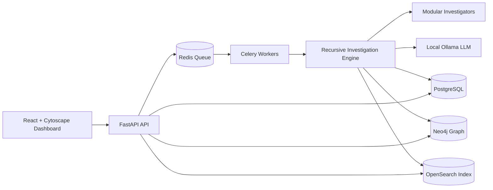

# Autonomous OSINT Investigation Platform

A production-oriented scaffold for legally compliant, recursive OSINT investigations. The platform accepts entities such as emails, phone numbers, usernames, domains, IPs, crypto wallets, social profiles, and names; runs modular investigators; extracts pivots; stores relationships in a graph; indexes findings; and streams investigation status to a React dashboard.

> Compliance note: this project is designed for authorized investigations and legally accessible sources only. Dark-web support is implemented as a gated connector interface with audit logging and policy checks; no illegal access, credential use, exploitation, or bypassing access controls is included.

## Architecture



## Quick start

```bash
cp .env.example .env
docker compose up --build
```

Services:

- API: http://localhost:8000
- API docs: http://localhost:8000/docs
- Frontend: http://localhost:5173
- Neo4j: http://localhost:7474
- OpenSearch: http://localhost:9200

## Investigation workflow

1. Submit an entity to `POST /api/investigations`.
2. FastAPI persists the investigation and enqueues the root entity.
3. Celery workers invoke the recursive engine.
4. Investigators return findings, relationships, and candidate entities.
5. The engine normalizes entities, calculates confidence, records graph edges, persists entities/findings/relationships, and queues new entities up to configured depth.
6. The dashboard polls and visualizes status, timeline, and graph relationships.

## Repository layout

```text
backend/                 FastAPI backend, Celery worker, investigators, tests
frontend/                React + TypeScript + Tailwind + Cytoscape UI
database/                PostgreSQL, Neo4j, and OpenSearch bootstrap schemas
docs/                    Architecture, API, deployment, scaling, plugin docs
k8s/                     Kubernetes-ready manifests
sample-data/             Safe synthetic investigation dataset
```

## Safety model

- Explicit legal-use banner and audit-friendly metadata.
- Dark-web connector is disabled unless `ENABLE_DARK_WEB=true` and policies pass.
- No credential stuffing, scraping behind authentication, exploit code, or bypass logic.
- Confidence scoring tracks provenance and investigator reliability.
- Docker deployments use `REPOSITORY_BACKEND=postgres` so API and Celery workers share durable investigation state; local tests can keep the in-memory backend.
- Synthetic local JSONL indexes demonstrate breach/dark-web metadata workflows without secret material or illicit access.
