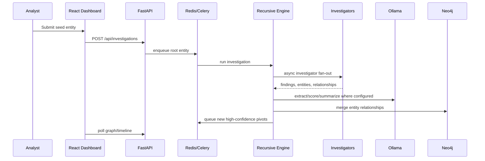

# Architecture

## Recursive logic

- Queue items contain entity, depth, and parent key.
- `visited` is keyed by normalized entity type and value.
- Entities below `min_confidence` are stored but not pivoted.
- Queue deduplication tracks already queued entities as well as visited entities to avoid duplicate work during broad fan-out.
- Deterministic scoring blends investigator reliability, finding confidence, validation metadata, source URLs, and policy blocks before optional LLM explanation.
- Processing stops when the queue drains or the configured depth limit is reached.
- Stabilization is reached when no new eligible entities remain.

## Investigator plugin contract

Each investigator implements `supports(entity)` and `investigate(entity) -> list[Finding]`. Findings may contain entities and relationships. The engine is responsible for storage, deduplication, and recursive queueing.

## Repository backends

- `memory` is intended for unit tests and single-process demos.
- `postgres` persists investigation state, entities, deduplicated relationships, and serialized findings for multi-process FastAPI/Celery deployments.
